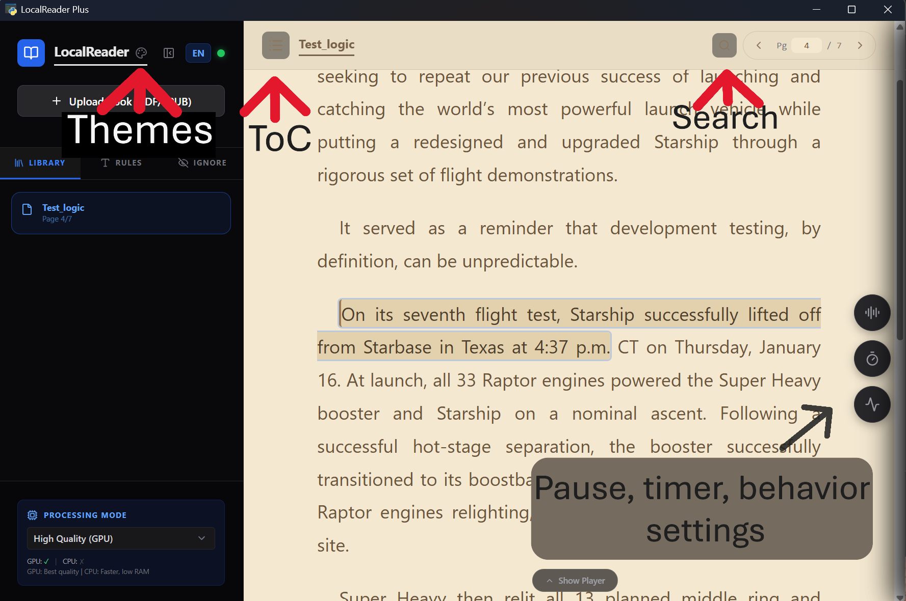

# LocalReader Plus

**A modern, that I fix and improve and fix many things.**
---
##🚨 due to redesign of code for this update if you download before it need to reinstall or remove any Library/books that your have inside apps, because in not compatibles with these update and do import again(add Epub/PDF)##
---
<div align="center">
  <h1>Brief</h1>
  
</div>


---
# What difference from LocalReader Pro(main)
   **Wave I**
   -  Have feature that handle reading number 
   -  Have more smart chunk (cut sentence before reach limit), is use IPA for count if reach limit of 510 phoneme if it nearly limit will cut it, smoothly.
   -  Have support with GPU NVDIA _NEED more setup_
   -  Delay audio startup or buffer startup, set to 1000ms - 1 seconde
   -  No .exe options for Windows.
   -  Have themes (auto save and default is dark mode open on LOGO "LocalReader")

   **Wave II**
   -  Add ToC/Table of Content support. (redeign convertor of EPUB and PDF)
   -  Add Images supprt.
   -  Add Match Case and Match Whole Word for search functions and imporve jump to selects result.
   -  Support auto switch languages, it currently Only support when use models voice English it will has fallback support with Japanese and China(Mandarin).
   -  Improve reliability of apps.
   -  Improve toggle player it will has auto hide(detect mouse movement), and manual hide change to rightside button of apps with **^** unhide display.
   -  Improve Export audio system it will use Pause/Behavior/voice settings.
   
   _Have detects 'ExecutionProvider' in Windows, Mac, and Linux for Kokoro_gpu models it should works in Gpu if it can will fallback to Cpu_
   (_default will run on Cpu, cuz Kokoro-onnx will install 'onnxruntime' **Cpu version** it will run on **Cpu** regradless of models 'Gpu'_)

# Many bug has been fix  #
   
   **-Fix pause setting not respond.**
   
   **-Fix preload system when apply pause setthing.** _tread off, is may happens when play audio (change pause settings) and change in real-time, it need to wait a little for settings apply when change pause, i mean it need to wait -old buffer setting end._
   
   **-Fix cache system cause repreat and skip reading, randomly.**
   
   **-Fix buffer not works as expect**
   
---
# Windows installation

   _Install **Python 3.12** if not install yet, _support Python 3.10-3.13_
   (Python 3.12 and 3.13 has been test, it can run no problem if it has I'll fix it)
   
  
  ## **First method for download** 
   Choose folders that needed to install and open teminal - _can delete .git in folder_
   
```
git clone https://github.com/curium-rp/LocalReader-Plus
```

```
cd LocalReader-Plus\dist
pip install -r requirements.txt
```
**And run**

```
python main.py
```
 ---
   ## **Second method** download zip and unzip it.

   Go to **LocalReader-Plus\ "dist"**  open teminal inside folder dist and run 
```
pip install -r requirements.txt
```
```
python main.py
```

   **If has some error when run python main.py say something like "kokoro" run uninstall onnxruntime and install back**
```
pip uninstall onnxruntime 
```
```
pip install onnxruntime
```

**(Run or skip to next step for NVIDIA GPU setup)**

---
## This is what needed to do for KOKORO model for run on NVIDIA GPU on WINDOWS

   install **cuda v12 [https://developer.nvidia.com/cuda-12-8-0-download-archive](https://developer.nvidia.com/cuda-12-8-0-download-archive)**
  
   install **cudnn v9 [https://developer.nvidia.com/cudnn-downloads](https://developer.nvidia.com/cudnn-downloads)**

   _Recomment to use custom install for not break NVDIA app check out of old version of NVDIA apps out and continue_

   _if this process break normal app NVDIA -stick with loading icon- just go download NVDIA app it and re-install_


**IF change files paths install location, you need to go for change paths inside main.py to make apps know it**
    

   Install onnxruntime-gpu  _Make sure you don't have onnxruntime cpu, it will cause conflicts_
   
   **-First uninstall both**
   
```
pip uninstall onnxruntime onnxruntime-gpu -y

```
   **-Second install onnxruntime-gpu**

```
pip install onnxruntime-gpu
```

   _Open powershell in **"dist"** folder_

> python main.py 

  Try to play it if didn't see red color text and  see yellow text say in last parts something like  "only guarantees to be correct if indices are not duplicated"  (don't forgot to download GPU models is need models TTS to make it work)
   
   It mean is run on GPU enjoy.


---

**Uninstalling:**

To completely remove the supporting software (Python and Libraries):

**Remove Libraries**: If you haven't deleted the folder yet, open a terminal in the "dist" folder and run: `pip uninstall -r requirements.txt`

**Uninstall Python**: Go to Windows Settings > Apps > Installed Apps, search for "Python 3.12", and select Uninstall.

**Clear Model Cache**: Many voices and AI models are stored in your user profile. You can delete the `.cache` folder in your user directory (usually `C:\Users\<YourName>\.cache\kokoro`) to free up additional space.

---

### Linux / Manual Installation

**Prerequisites:** Python 3.10 - 3.13 (Recommended: Python 3.12 )

> ⚠️ **Important:** Python 3.14 I didn't test yet, for 3.13 it can run and no problem has been found

**Step 1: Install Python**

```bash
# Ubuntu/Debian
sudo apt update
sudo apt install python3.12 python3.12-pip python3.12-venv

# Verify installation
python3.12 --version
```

**Step 2: Extract and Navigate**

```bash
unzip LocalReader-Plus-main.zip
cd LocalReader-Plus-main/dist
```

**Step 3: Install Dependencies**

```bash
# Option A: Using pip
pip install -r requirements.txt

# Option B: Using python -m pip (if pip not in PATH)
python3.12 -m pip install -r requirements.txt
```


**Step 4: Launch the App**

```bash
python3.12 main.py
```
_(IF Mac or Linux has problem with error in Termimal when first run >main.py Do uninstall onnxruntime and install back)_
---
## 🔘for Original visit [Original LocalReader-Pro](https://github.com/revisionhiep-create/LocalReader-Pro)


### Custom Pause Settings

1. Open **"Pause Settings"** section in sidebar
2. Adjust sliders to set pause duration (0-2000ms):
   - **Comma (,)** - Default: 250ms
   - **Period (.)** - Default: 0ms (_it overlap with segment pause `N`, cuz logic cut sentence use preiod stop_)
   - **Question (?)** - Default: 600ms
   - **Exclamation (!)** - Default: 600ms
   - **Colon (:)** - Default: 500ms
   - **Semicolon (;)** - Default: 500ms

 **!(New) Behavior settings:**
   - `Header Pause (H)` Gives the user breathing room between a Chapter Title and the story text (0ms to 10s). default 2 second
   - `Image Pause` Creates a temporary silence while an image or cover is displayed on the screen before reading continues (0ms to 20s). default 3 second
   - `Scene Pause` Handles dramatic pauses for elegant scene changes (like *** or ◇◇◇).have it (0ms to 5s). default 1 second
   - `Segment Pause (N)` Controls the tiny micro-pauses between standard text blocks/sentences will have 0-2000ms. default 500ms

   
3. Settings save automatically

   **Smart Behavior:**

- Pauses apply only to single punctuation or the last char of a group
- `"..."` creates ONE pause (e.g. 600ms), not three
- `"?!` creates ONE pause (based on `!`)

  
---

## 🔳 Keyboard Shortcuts

| Key                | Action            |
| ------------------ | ----------------- |
| `Space`            | Play/Pause        |
| `←`                | Previous Sentence |
| `→`                | Next Sentence     |
| `Ctrl+F` / `Cmd+F` | Open Search       |
| `ESC`              | Close Search      |

---

## ⚙️ Technical Details

### Architecture

| Layer               | Technology                        |
| ------------------- | --------------------------------- |
| **Frontend**        | Vanilla JavaScript + Tailwind CSS |
| **Backend**         | FastAPI (Python)                  |
| **TTS Engine**      | Kokoro-82M (ONNX Runtime)         |
| **Desktop Wrapper** | pywebview                         |
| **Audio Export**    | pydub + FFMPEG                    |
| **EPUB Support**    | EbookLib + BeautifulSoup4         |
| **PDF Support**     | PyMuPDF (fitz)                    |

### File Structure

```
LocalReader-Plus
├── README.md
├── CHANGELOG.md
└── dist/
    ├── main.py                  # App entry point (FastAPI + WebView)
    │
    ├── app/
    │   ├── server.py            # FastAPI initialization
    │   ├── state.py             # Global engine/status singleton
    │   ├── routers/             # API Controllers (TTS, Library, Export, etc.)
    │   ├── logic/               # Core logic (Normalize, Detector, Cache)
    │   ├── locales/             # UI Translations (EN, ES, FR, ZH, JA)
    │   └── ui/
    │       ├── index.html       # Main SPA
    │       ├── css/style.css    # Premium styling
    │       └── js/modules/      # ES6 Logic modules
    │
    └── userdata/                # User settings and book database
```

**Additional folders created during use:**

- `dist/bin/` - FFMPEG binaries  ~~(auto-downloaded on first export)~~
- `app/models/` - TTS engine models (auto-downloaded based on your choice)
- `dist/userdata/audio_cache.db` - SQLite Audio Cache
- `dist/audio files`- for files that Export will live inside this folder

### Storage & Installation Estimates

| Component                   | Estimated Size     | Notes                                             |
| :---                        | :---               | :---                                              |
| **App ZIP & Source**        | ~4 MB              | Core application logic and UI                     |
| **Python Environment**      | ~800 MB            | ONNX Runtime, FastAPI, etc. *(PyTorch removed)*   |
| **TTS Engine (GPU)**        | ~309 MB            | Standard FP32 model                               |
| **TTS Engine (CPU)**        | ~87 MB             | Quantized INT8 model                              |
| **Voice Pack**              | ~30 MB             | Shared acoustic data for voices                   |
| **Audio Cache (SQLite)**    | ~200 MB            | Auto-managed (Maximum limit)                      |
| **Document Cache**          | 1 - 10+ MB         | Size per parsed book                              |
| **FFmpeg**                  | ~100 MB            | *Optional* - Downloaded on-demand for MP3 exports |
| **Exported Audio**          | Varies             | ~1 MB (MP3) / ~2.7 MB (WAV) per minute of audio   |
| **CUDA (12.xx)**            | 3.0 - 4.5 GB       | *Optional* - System-level GPU acceleration        |
| **cuDNN (9.xx)**            | ~3.0 GB            | *Optional* - Deep learning GPU primitives         |

> **🎙️ Export ** > Support export with Toc point to point and single point _
   - Point to point mean can select start point and end point with Header tag (default)
   - Separate files, mean point to point but will save one by one of chapter/header.
   - Single mode, mean select only one chapter of books and Export.
   


#### Estimated Installation Totals
*Calculated using the Base App + Python Environment + Models. Excludes optional CUDA/cuDNN installations, user document caches, and exported audio files.*

* **Total (CPU Mode):** ~450 MB *(Lightweight & Low RAM)*
* **Total (GPU Mode):** ~650 MB *(Standard Quality)*
* **Total (Both Engines):** ~750 MB *(Maximum Flexibility)*

### System Requirements

| Component      | Minimum                     | Recommended                    |
| -------------- | --------------------------- | ------------------------------ |
| **OS**         | Windows 10+ / Ubuntu 20.04+ | Windows 11 / Ubuntu 22.04+     |
| **Python**     | 3.10 - 3.13                 | 3.12                           |
| **RAM**        | 4 GB                        | 8 GB+                          |
| **Disk Space** | 3 GB free                   | 20 GB+ free                    |
| **CPU**        | Dual-core 2.0 GHz           | Quad-core 2.5 GHz+    GPU      |
| **Internet**   | Required for setup only     | Offline after setup            |

---

## 🔘 Privacy & Security

### Data Storage

- **100% Local:** All documents, settings, and exports stored on your machine
- **No Cloud:** Zero data sent to external servers
- **No Accounts:** No login, no sign-up, no user tracking

### Analytics & Telemetry

- **Zero Tracking:** No analytics, no usage stats, no crash reports
- **No Cookies:** Web UI runs locally
- **No Logs:** App doesn't phone home

### File Access

- **Read-Only Documents:** PDFs/EPUBs are only read (never modified)
- **Writable Folders:** Only `userdata/`, `audio files/`, `models/`, `bin/`, and `.cache/`
- **No Background Access:** App closes completely when you exit

---

## 🔳 License

###LocalReader plus (main LocalReader Pro )

- **Code:** Proprietary (review, modify, use personally)
- **Redistribution:** Contact author for permission

### 📜 Open Source Acknowledgements

This project is made possible thanks to the following open-source libraries and frameworks:

| Component/Library                                                      | License      | Usage                                  |
| :---                                                                   | :---         | :---                                   |
| **[FastAPI](https://fastapi.tiangolo.com/)**                           | MIT          | High-performance backend API framework |
| **[Kokoro-ONNX](https://github.com/thewh1teagle/kokoro-onnx)**         | MIT          | Core TTS Engine wrapper                |
| **[ONNX Runtime](https://onnxruntime.ai/)**                            | MIT          | Hardware-accelerated AI inference      |
| **[PyMuPDF](https://pymupdf.readthedocs.io/)**                         | GNU AGPL     | Native PDF text and image extraction   |
| **[EbookLib](https://github.com/aerkalov/ebooklib)**                   | AGPL         | EPUB document parsing and unpacking    |
| **[BeautifulSoup4](https://www.crummy.com/software/BeautifulSoup/)**   | MIT          | HTML sanitization and TOC generation   |
| **[Fugashi](https://github.com/polm/fugashi)**                         | MIT          | Japanese morphological analysis        |
| **[jaconv](https://github.com/ikegami-yukino/jaconv)**                 | MIT          | Jp/zh character width normalization    |
| **[num2words](https://github.com/savoirfairelinux/num2words)**         |  LGPL        |Handle reading number             |
| **[FFmpeg](https://ffmpeg.org/)**                                      | GPL / LGPL   | On-demand audio format conversion      |
---

## ⚪ Credits

### Core Technologies

- **TTS Engine:** [Kokoro-82M](https://huggingface.co/hexgrad/Kokoro-82M) by hexgrad
- **UI Framework:** [Tailwind CSS](https://tailwindcss.com/) / [github](https://github.com/tailwindlabs/tailwindcss)
- **Icons:** [Lucide](https://lucide.dev/)
- **Audio Processing:** [FFMPEG](https://ffmpeg.org/)
  
---

### Found a Bug? Support

  1. Check what missing and try to use pip instal it 
  or check error massage in terminal
  3. Open ticket with:
      - Python version (`python --version`)
      - OS
      - Error message or screenshot
  _New feature? ticket or help me and pull request_
      
   
 

---


**Engine:** Kokoro onnx-82M (Dual-Mode: CPU/GPU)

**Last Original LocalReader Pro updated:**January 6, 2026
---
**Last Updated** June 27, 2026

---
***Epub or Pdf files should not be DRM (Digital Rights Management)***

**Enjoy listening ! 🔳⚪**

