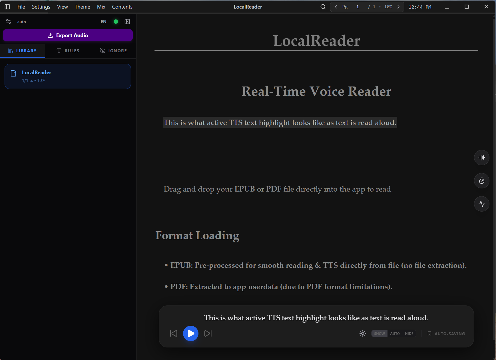

<div align="center">
  <h1>LocalReader Plus</h1>
</div>

**A modern app that used Kokoro TTS, rebuilt offline reader: fixed, optimized, and significantly improved.**
---
### 🚨Update september 17, 2026 ##
---
<div align="center">
  <h1>Brief</h1>
  
</div>


---

**Python versions support**:
- Python 3.10 - 3.13 (Tested on windows: 3.10 to 3.13 run without any issue)
- For python 3.14 can run and seem memories leak it gone.

### Models

*   **High Quality (FP32)**: Load `kokoro.onnx`. (Recommended)
    *   **Priority**: Load CUDA Execution Provider (GPU). 
    *   **Fallback**: CPU 
    *   **Performance**: CPU run near real-time (tested on AMD Ryzen 4800HS, Initial load slower then GPU load). Recommended for maximum audio quality.
 

>For manual install, default dependencies it ONNXRUNTIME CPU it will run on CPU
</br>

## Windows Installation 

### use executable files tool (.exe) - Recommended

&emsp;It will install UV if you don't have yet through PowerShell and you can select onnxruntime CPU/GPU version with .exe or select optional CMD GUI shortcut for change onnxruntime version later.

&emsp;&emsp;-Recommended to used CPU VERSION (Standard) in page ONNX Engine Configuration on Installer (.exe). it mean run Kokoro model on CPU
  
&emsp;&emsp;-It will install all dependencies, automatically.
   
&emsp;&emsp;-This Apps use UV to manage dependencies and virtual environment.


    


</br>

> **Note:** If you want manual install, need to run without a virtual environment or prefer the standard `.venv` method or need to manual install with uv, please see the full instructions in [`INSTALL.txt`](https://github.com/curium-rp/LocalReader-Plus/blob/main/INSTALL.txt).


</br>

## 🍎🐧 Mac & Linux Installation (Virtual Environment with Uv)

> **Note:** I tested on VMware/Wsl Linux can't do test as a full install, it may has some problem or error please understand, and Mac os no hardware tested yet, it may not work.

> **Note:** If you prefer the standard `.venv` method, please visit [`INSTALL.txt`](https://github.com/curium-rp/LocalReader-Plus/blob/main/INSTALL.txt).
>

**Extra setup `ffmpeg` for pydub if didn't have it.**
>
Mac (using homebrew):
```
brew install ffmpeg
```
Linux it will need `ffmpeg` for pydub and `libsndfile` for soundfile and some of pywebview support (using aptitude):
```
sudo apt update && sudo apt install -y build-essential gcc pkg-config libgirepository1.0-dev libcairo2-dev python3-dev gir1.2-gtk-3.0 gir1.2-webkit2-4.1 ffmpeg libavcodec-extra libsndfile1
```

### Step 1: Install Uv

If you don't have `uv` installed, use one of the following commands:

**Using Curl (Linux & macOS):**

```bash
curl -LsSf https://astral.sh/uv/install.sh | sh
```

**Using Homebrew (macOS Alternative):**

```bash
brew install uv

```

### Step 2: Setup and Run Environment

Open your Terminal inside the `LocalReader-Plus/dist/` folder and run the following commands to set everything up:

bash
```bash

uv venv --python 3.12

uv pip install -r requirements.txt

uv run main.py

```
>⚠️ Note **Linux**, if has error fail to build 'pygobject' run this command, then go back to run `uv pip install` again
```
uv pip install --no-cache pycairo PyGObject pywebview[gtk]
```
</br>

>*`uv pip` and `uv run` will automatically find and use virtual environment during subsequent invocations.*

</br>
---

---
</br>

## NVIDIA GPU (WINDOWS) manual setup onnxruntime-gpu
 >more info of about ONNXRUNTIME Execution Providers visit [onnxruntime.ai/docs](https://onnxruntime.ai/docs/execution-providers/)

</br>

### First method install the necessary CUDA and cuDNN runtime DLLs alongside the onnxruntime-gpu package

</br>

If use manual install, first navigate to folder `dist` and open Terminal
If use .exe go to program or folder that you install and click folder `LocalReader plus` > open PowerShell/CMD

>if used installer to install app used shortcut `engine_setup.CMD` or used command line to change it


```
uv pip install onnxruntime-gpu[cuda,cudnn]
```
That all and run `uv run main.py`

</br>
---

### Second method install full version

   install **cuda v12 [https://developer.nvidia.com/cuda-12-8-0-download-archive](https://developer.nvidia.com/cuda-12-8-0-download-archive)**
  
   install **cudnn v9 [https://developer.nvidia.com/cudnn-downloads](https://developer.nvidia.com/cudnn-downloads)**

   _Recomment to use custom install for not break NVDIA app check out of old version of NVDIA apps out and continue_

   _if this process break normal app NVDIA -stick with loading icon- just go download NVDIA app it and re-install_


**IF change files paths install location, you need to go for change paths inside `main.py` to make apps know it**
   
```powershell

uv pip install onnxruntime-gpu
```
>`uv run main.py`


  if Active Hardware Linked = $${\color{green}CUDA}$$  it mean it run on NVIDIA GPU.


---

**Uninstalling:**

**Remove .venv and folder of LocalReader_plus**: 

for uninstall uv go [docs.astral.sh/uv](https://docs.astral.sh/uv/getting-started/installation/)  and scroll down to buttom of web it will have Uninstallation.

For use .exe you can go to settings "installed apps" and uninstall LocalReader Plus


### Custom Pause Settings

1. Open **"Pause Settings"** section in sidebar
2. Adjust sliders to set pause duration (0-2000ms):
   - **Comma (,)** -it may has negative effects for output voice (audio glitches) when use this setting. Default: 0ms
   - **spam symbols (...,?!?,???)** - _it will start apply when have to full stop, (?) and (!), more then 2 
      -it can mix together and it can stack when it has more spam it, more spam more pause default: 0ms
   - **Question (?)** - Default: 600ms
   - **Exclamation (!)** - Default: 600ms
   - **Colon (:)** - Default: 500ms
   - **Semicolon (;)** - Default: 500ms

 **!Playback Behavior :**
   - `Header Pause (H)` Gives the user breathing room between a Chapter Title and the story text (0ms to 10s). default 2 second
         -It will apply in front of header 100% and close H 30% 
         -It will apply less settings ms by H2/2, H3/1.5 - apply H2 half of H1 tag

   - `Image Pause` Creates a temporary silence while an image or cover is displayed on the screen before reading continues (0ms to 20s). default 3 second
   - `Scene Pause` Handles dramatic pauses for elegant scene changes (like *** or ◇◇◇).have it (0ms to 5s). default 1 second
   - `Segment Pause (N)` Controls the tiny micro-pauses between standard text blocks/sentences will have 0-2000ms. default 500ms

   
> Settings save automatically

  </br>
---

## 🔳 Keyboard Shortcuts

| Key                |  Media key          | Action             |
| :---               | :---                | :---               |
| `Space`            | Play/Pause Track    | Play/Pause         |
| `←`                | Previous Track      | Previous Sentence  |
| `→`                | Next Track          | Next Sentence      |
| `Ctrl+F` / `Cmd+F` |          -          | Open Search        |
| `ESC`              |          -          | Close Search       |

---
</br>

## ⚙️ Technical Details

### Architecture

| Layer               | Technology                        |
| ------------------- | --------------------------------- |
| **Frontend**        | Vanilla JavaScript + Tailwind CSS |
| **Backend**         | FastAPI (Python)                  |

<br/>

<details>
<summary><b>Click to expand the full File Tree)</b></summary>

```text
|   .gitattributes
|   .gitignore
|   COPYING
|   INSTALL.txt
|   README.md
|
\---dist
    |   main.py
    |   platform_driver.py
    |   requirements.txt
    |   uv.toml
    |   window_manager.py
    |
    +---app
    |   |   config.py
    |   |   files_api.py
    |   |   models.py
    |   |   server.py
    |   |   state.py
    |   |   utils.py
    |   |   __init__.py
    |   |
    |   +---engine
    |   |   |   zipstream-darwin-arm64.dylib
    |   |   |   zipstream-darwin-x64.dylib
    |   |   |   zipstream-linux-x64.so
    |   |   |   zipstream-win-x64.dll
    |   |   |
    |   |   \---native
    |   |       |   libz.tbd
    |   |       |   stack_chk.c
    |   |       |   zipstream.cpp
    |   |       |
    |   |       \---zlib_inc
    |   |               zconf.h
    |   |               zlib.h
    |   |
    |   +---locales
    |   |       en.json
    |   |       es.json
    |   |       fr.json
    |   |       zh.json
    |   |
    |   +---logic
    |   |       chinese_g2p.py
    |   |       dependency_manager.py
    |   |       downloader.py
    |   |       html_normalizer.py
    |   |       japanese_g2p.py
    |   |       language_switcher.py
    |   |       memories.py
    |   |       smart_content_detector.py
    |   |       syllable.py
    |   |       text_normalizer.py
    |   |       __init__.py
    |   |
    |   +---models
    |   |   \---Kanjium
    |   |           kanjium_pitch.json
    |   |
    |   +---native_api
    |   |   |   native_shell.dll
    |   |   |   native_snap.dll
    |   |   |
    |   |   \---native
    |   |           native_shell.cpp
    |   |           native_snap.cpp
    |   |
    |   +---routers
    |   |       export.py
    |   |       library.py
    |   |       redirect.py
    |   |       render.py
    |   |       settings.py
    |   |       system.py
    |   |       theme.py
    |   |       timer.py
    |   |       tts.py
    |   |       view.py
    |   |
    |   \---ui
    |       |   index.html
    |       |   __init__.py
    |       |
    |       +---css
    |       |       reader-typography.css
    |       |       style.css
    |       |
    |       +---js
    |       |   |   app.js
    |       |   |   search.js
    |       |   |   shortcuts.js
    |       |   |
    |       |   \---modules
    |       |           api.js
    |       |           downloader.js
    |       |           export.js
    |       |           files_UI.js
    |       |           history.js
    |       |           horizontal.js
    |       |           library.js
    |       |           progress.js
    |       |           reader-layout.js
    |       |           recent.js
    |       |           resize.js
    |       |           state.js
    |       |           themes.js
    |       |           timer.js
    |       |           topbar.js
    |       |           tts.js
    |       |           typography.js
    |       |           ui.js
    |       |           wakelock.js
    |       |
    |       \---lib
    |               lucide.min.js
    |               tailwindcss-with-all-plugins.js
    |
    \---userdata
```
</details>

<br/>


**Additional folders created during use:**

- `dist/bin/` - FFMPEG binaries  (auto import it has in system)
- `app/models/` - TTS engine models (auto-downloaded based on your choice)
- `dist/audio files`- for files that Export is inside this folder

### Storage & Installation Estimates

| Component                   | Estimated Size     | Notes                                             |
| :---                        | :---               | :---                                              |
| **App ZIP & Source**        | ~4 MB              | Core application logic and UI                     |
| **Python Environment**      | ~800 MB            | ONNX Runtime, FastAPI, etc. *(PyTorch removed)*   |
| **TTS Engine (FP32)**        | ~309 MB            | Standard FP32 model  (Recommended)                |
| **TTS Engine (INT8)**        | ~87 MB             | Quantized INT8 model                              |
| **Voice Pack**              | ~30 MB             | Shared acoustic data for voices                   |
| **Document Cache**          | ~~~~               | A little bit larger then original files                               |
| **FFmpeg**                  | ~100 MB            | *Optional* - Downloaded on-demand for MP3 exports |
| **Exported Audio**          | Varies             | ~1 MB (MP3) / ~2.7 MB (WAV) per minute of audio   |
| **CUDA (12.xx)**            | 3.0 - 4.5 GB       | *Optional* - System-level GPU acceleration        |
| **cuDNN (9.xx)**            | ~3.0 GB            | *Optional* - Deep learning GPU primitives         |
>
>Preloading DLLs from NVIDIA Site Packages with onnxruntime [cuda and cudnn] : Estimated Size 2.37 GB


> **🎙️ Export ** > Support export with Toc point to point and single point _
   - Point to point mean can select start point and end point with Header tag (default)
   - Separate files, mean point to point but will save one by one of chapter/header.
   - Single mode, mean select only one chapter of books and Export.
   


#### Estimated Installation Totals
*Calculated using the Base App + Python Environment + Models. Excludes optional CUDA/cuDNN installations, user document caches, and exported audio files.* 

* **Total (FP32 model):** ~900 MB 
* **Total (INT8 model):** ~1000 MB *(Standard Quality)*
* **Total (Both Engines):** ~1100 MB *(Maximum Flexibility)*

---

### Data Storage

- **100% Local:** All documents, settings, and exports stored on your machine, only used internet when install or download voice models
- **No Cloud:** Zero data sent to external servers
- **No Accounts:** No login, no sign-up, no user tracking

### Analytics & Telemetry

- **Zero Tracking:** No analytics, no usage stats, no crash reports
- **No Cookies:** Web UI runs locally
- **No Logs:** App doesn't phone home

### File Access

- **Read-Only Documents:** PDFs/EPUBs are only read (never modified)
- **Writable Folders:** Only `userdata/`, `audio files/`, `models/`, `bin/`, and `.cache/`
- **No Background Access:** App closes completely when you exit

---


### 📜 Open Source Acknowledgements

This project is made possible thanks to the following open-source libraries and frameworks:

| Component/Library                                                      | License      | Usage                                  |
| :---                                                                   | :---         | :---                                   |
| **[FastAPI](https://fastapi.tiangolo.com/)**                           | MIT          | High-performance backend API framework |
| **[Kokoro-ONNX](https://github.com/thewh1teagle/kokoro-onnx)**         | MIT          | Core TTS Engine wrapper                |
| **[ONNX Runtime](https://onnxruntime.ai/)**                            | MIT          | Hardware-accelerated AI inference      |
| **[PyMuPDF](https://pymupdf.readthedocs.io/)**                         | GNU AGPL     | Native PDF text and image extraction   |
| **[Selectolax](https://github.com/rushter/selectolax)**                | MIT          | HTML sanitization, TOC generation   |
| **[Fugashi](https://github.com/polm/fugashi)**                         | MIT          | Japanese morphological analysis        |
| **[jaconv](https://github.com/ikegami-yukino/jaconv)**                 | MIT          | Jp/zh character width normalization    |
| **[num2words](https://github.com/savoirfairelinux/num2words)**         |  LGPL        |Handle reading number             |
| **[FFmpeg](https://ffmpeg.org/)**                                      | GPL / LGPL   | On-demand audio format conversion      |
---

- **Open Source copyright Note:** This project links to and utilizes dependencies licensed under open-source agreements (including MIT, AGPL, and GPL). In compliance with those underlying libraries.


## ⚪ Credits

### Core Technologies

- **TTS Engine:** [Kokoro-82M](https://huggingface.co/hexgrad/Kokoro-82M) by hexgrad
- **UI Framework:** [Tailwind CSS](https://tailwindcss.com/) / [github](https://github.com/tailwindlabs/tailwindcss)
- **Icons:** [Lucide](https://lucide.dev/)
- **Audio Processing:** [FFMPEG](https://ffmpeg.org/)
  
---

</br>

**Epub or Pdf files should not be DRM (Digital Rights Management)**

**Enjoy listening ! 🔳⚪**

</br>

---

### Credits

### 🔘Based on the initial project by [LocalReader-Pro](https://github.com/revisionhiep-create/LocalReader-Pro)

